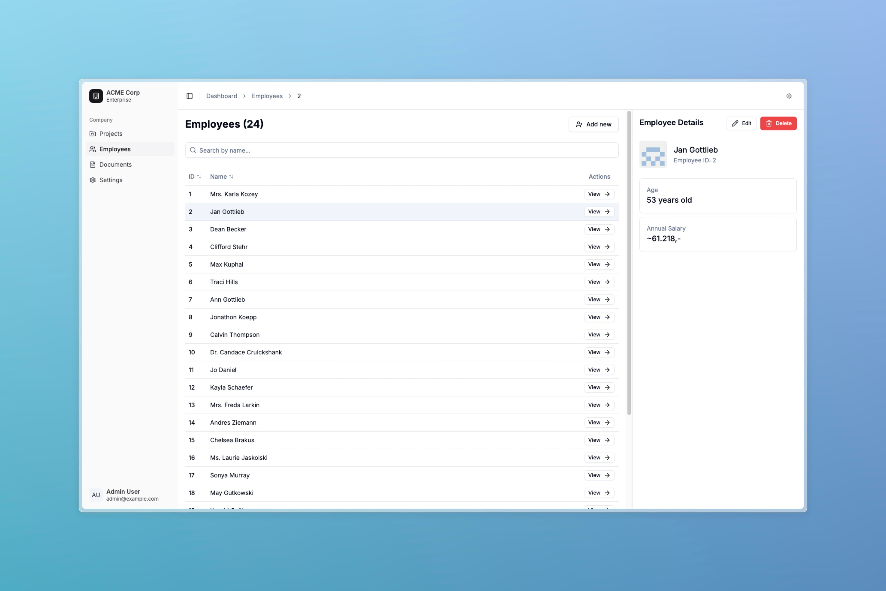

# Employee Management Dashboard

A modern, responsive web application built with Next.js 13 for managing employee data. This project demonstrates best practices in React development, state management, form handling, and UI/UX design.



## ⏳ Time Tracking

Total time spent: ~15 hours over a week

## 🔧 API Implementation Note

During the development process, I encountered issues with the provided API, which consistently returned 404 errors. As a result, I had to rebuild the API from scratch to ensure the application could function correctly. This involved setting up a new backend service that mimicked the expected API endpoints and responses, allowing the frontend to perform CRUD operations seamlessly. The backend server code can be found at https://github.com/mehdiamrane/employees-api

## 🌟 Live Demo

The application is deployed and can be accessed at:
https://employees-app-demo.vercel.app. The API may take up to a minute to boot up.

## ✨ Features

- Complete CRUD operations for employee management
- Responsive design that works seamlessly on desktop and mobile
- Real-time search and filtering
- Form validation with Zod
- Optimistic updates for better UX
- Error boundary handling
- Unit tests
- Dark/light mode support

## 🛠 Tech Stack

- Next.js 13 with App Router
- TypeScript
- TanStack Query for data fetching
- React Hook Form + Zod for form handling
- Tailwind CSS + shadcn/ui for styling
- Jest + React Testing Library for testing
- Husky for git hooks

## 🚀 Getting Started

### 📋 Prerequisites

Before you begin, ensure you have the following requirements:

- Node.js 20.9 or higher (recommended to use nvm)
- npm 10.x or higher
- Git

### 🧰 Environment Setup

1. Install nvm (Node Version Manager) following this [documentation](https://github.com/nvm-sh/nvm?tab=readme-ov-file#installing-and-updating)

2. Install the correct Node.js version:

```bash
nvm install 20.9
nvm use 20.9
```

3. Verify your installation:

```bash
node --version  # Should output v20.9.x
npm --version   # Should output 10.x.x
```

### 💻 Running locally

1. Clone the repository:

```bash
git clone https://github.com/mehdiamrane/employees-app.git
```

2. Install dependencies:

```bash
npm install
```

3. Create a new `.env` file at the root of the project with the following content:

```bash
NEXT_PUBLIC_API_URL=https://employees-api-3lcx.onrender.com
```

You can replace the API url with the [backend server](https://github.com/mehdiamrane/employees-api) running locally if you'd like.

4. Run the development server:

```bash
npm run dev
```

The application will be available at http://localhost:3000

## 🧪 Testing

Run the test suite:

```bash
npm run test
```

View test coverage:

```bash
npm run test:coverage
```

## 💡 Implementation Details

### Architecture

- Kept the clean architecture pattern separating concerns into domain, components and application layers
- Implemented proper error handling and loading states
- Added comprehensive type safety with TypeScript

### UI/UX

- Created a responsive layout that adapts to different screen sizes
- Added loading skeletons for better perceived performance
- Included proper form validation with error messages
- Added toast notifications for operation feedback

### Testing

- Unit tests for components

## 🔄 Continuous Integration

The project uses GitHub Actions for:

- Running tests
- Type checking
- Linting
- Commit message validation

## 🎯 Areas for Improvement

Given more time, I would:

1. Add more unit tests for components, functions and hooks using Jest
2. Add E2E tests using Cypress or Playwright
3. Setup storybook to document UI components with examples and visual testing

## 📝 Code Quality

- Followed consistent coding standards
- Used proper TypeScript types throughout
- Implemented proper error handling
- Used conventional commits for better version control
- Maintained clean and DRY code principles

# 📄 Original Readme

<details>
  <summary>Click to see the original readme with requirements.</summary>

# Frontend Challenge

## Build a web app with Next.js 13

As a frontend developer you get the task to implement a frontend for an employee API, where you can
list, create, read, update and delete employees.

### API

Use [restapiexample.com](https://dummy.restapiexample.com)

> [!WARNING]
> API has a rate limit

A base structure is already implemented.
Feel free to improve the current implementation whenever you see potential or let us know what you
would do differently in your pull requests description.

Please fork our repo and implement the missing features. Also track time and let us know how long it
took you to finish the challenge.

### Run It

```bash
$ nvm exec 20.9 npm run dev
```

By default, the app is reachable at `http://127.0.0.1:3000`

### Setup

Currently we are using node `20.9` so we recommend to use `nvm`.

Install `nvm` by following this
[guide](https://www.freecodecamp.org/news/node-version-manager-nvm-install-guide/).

Install and use node `20.9`:

```bash
$ nvm use
```

> [!TIP]
> Don't forget to install the node packages:

```bash
$ npm i
```

### Formatting

Prettier is our formatter of choice. We added some settings for VSCode. If you use a different IDE please adapt the settings.

</details>
